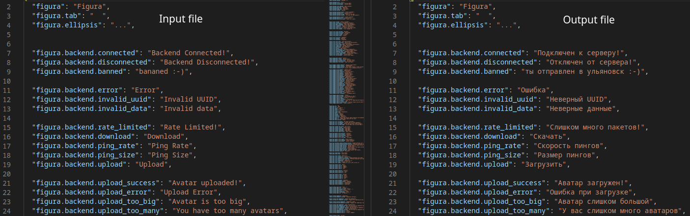

# TranslationHelper
This is a little script i using for [translation of Figura](https://github.com/lexize/FiguraRewriteRussianTranslation).
## How it works?
It checking for new translation keys, notifies about string changes and deletions, and exporting translated eng file with formatting saving.

What exactly script does?
1. Script opens latest lang file and previous lang file, and checking for strings changes, and deletions, and also notifies about all changes. All changed keys script stores into list.
2. After that script opens your translation file, and stores key-pair with translations in dictionary.
3. Script gets text for latest eng file, and replacing values in file by values stored in dictionary, if:
    1. Key of value doesn't listed in changed string list
    2. Value with this key exists
    3. Translated value isn't same as in original, untranslated file.
4. Script exporting changed lang file with name of output file

### Usage
`dotnet run [0] [1] [2] [3]`

0. Name of latest eng file
1. Name of previous eng file
2. Name of your current translation file
3. Name of output translation file